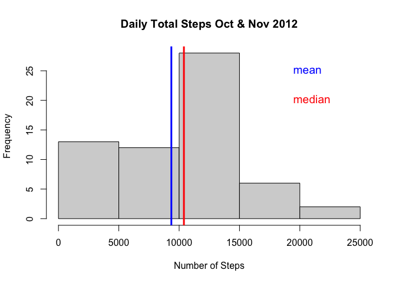

```r
knitr::opts_chunk$set(echo = TRUE)
library(data.table)
```

## Loading and preprocessing the data

```r
# unzip if not yet done
if (!file.exists("./activity.csv")) {
    unzip(zipfile = "./activity.zip",
          exdir = ".")
}

dt <- data.table::fread(file = "./activity.csv")
```


## What is mean total number of steps taken per day?

```r
# daily aggregation
aggregated_by_day <- dt[, .(daily_total = sum(steps, na.rm = TRUE)),
                        keyby = .(date)]

mean_by_day <- round(mean(aggregated_by_day$daily_total), 0)
```
Mean total number of steps taken per day: 9354


## What is the average daily activity pattern?

```r
# plot histogram
hist(aggregated_by_day$daily_total,
     xlab = "Number of Steps",
     main = "Daily Total Steps Oct & Nov 2012")

# calculate & plot mean
daily_mean <- round(mean(aggregated_by_day$daily_total, na.rm = TRUE), 0)
abline(v = daily_mean, col="blue", lwd = 3)

# calculate & plot median
daily_median <- median(aggregated_by_day$daily_total, na.rm = TRUE)
abline(v = daily_median, col="red", lwd = 3)

# annotate
text(19000, 25, "mean",   col = "blue", cex = 1.2, pos = 4)
text(19000, 20, "median", col = "red",  cex = 1.2, pos = 4)
```

<!-- -->
  
The mean of the daily number of steps taken: 9354  
The median of the daily number of steps taken: 10395


## Imputing missing values


## Are there differences in activity patterns between weekdays and weekends?
