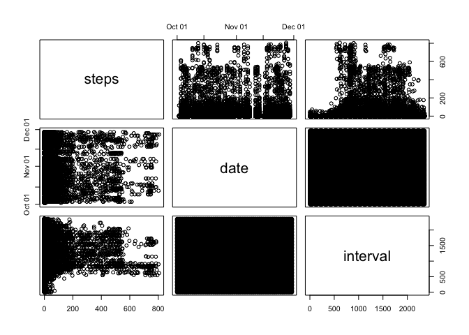
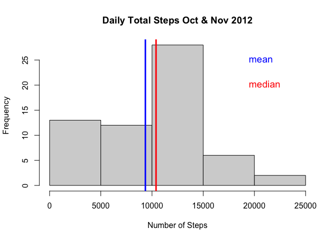
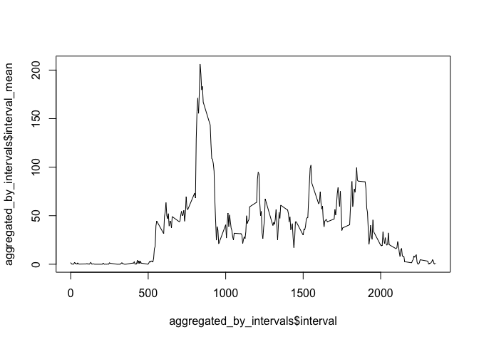
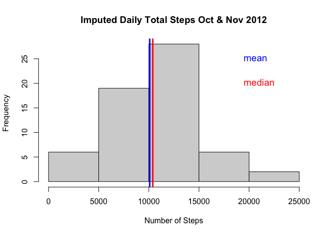
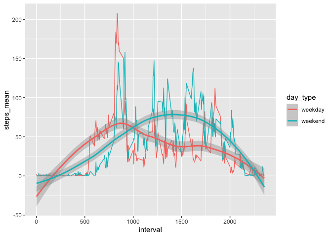
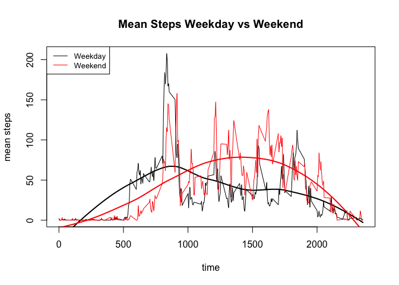

```r
knitr::opts_chunk$set(echo = TRUE)
library(data.table)
```

***
## Loading and preprocessing the data

```r
# unzip if not yet done
if (!file.exists("./activity.csv")) {
    unzip(zipfile = "./activity.zip",
          exdir = ".")
}

dt <- data.table::fread(file = "./activity.csv")
head(dt)
```

```
##    steps       date interval
## 1:    NA 2012-10-01        0
## 2:    NA 2012-10-01        5
## 3:    NA 2012-10-01       10
## 4:    NA 2012-10-01       15
## 5:    NA 2012-10-01       20
## 6:    NA 2012-10-01       25
```

### Pairs

```r
# preview
pairs(dt)
```

<!-- -->

***
## What is mean total number of steps taken per day?

```r
# daily aggregation
aggregated_by_day <- dt[, .(daily_total = sum(steps, na.rm = TRUE)),
                        keyby = .(date)]

mean_by_day <- round(mean(aggregated_by_day$daily_total), 0)
```
Mean total number of steps taken per day: 9354

***
### Histogram I.

```r
# plot histogram
hist(aggregated_by_day$daily_total,
     xlab = "Number of Steps",
     main = "Daily Total Steps Oct & Nov 2012")

# calculate & plot mean
daily_mean <- round(mean(aggregated_by_day$daily_total, 
                         na.rm = TRUE), 0)
abline(v = daily_mean, col = "blue", lwd = 3)

# calculate & plot median
daily_median <- median(aggregated_by_day$daily_total,
                       na.rm = TRUE)
abline(v = daily_median, col = "red", lwd = 3)

# add text 'mean'
text(19000,
     25,
     "mean",
     col = "blue",
     cex = 1.2,
     pos = 4)

# add text 'median'
text(19000,
     20,
     "median",
     col = "red",
     cex = 1.2,
     pos = 4)
```

<!-- -->
  
The mean of the daily number of steps taken: 9354  
The median of the daily number of steps taken: 10395

***
## What is the average daily activity pattern?
Make a time series plot (i.e. type = "l") of the 5-minute interval (x-axis) and the average number of steps taken, averaged across all days (y-axis)
Which 5-minute interval, on average across all the days in the dataset, contains the maximum number of steps?

```r
# aggregate by intervals
aggregated_by_intervals <- dt[, .(interval_mean = mean(steps, na.rm = TRUE)), 
                              keyby = .(interval)]
# plot
plot(x = aggregated_by_intervals$interval,
     y = aggregated_by_intervals$interval_mean,
     type = "l")
```

<!-- -->

```r
# determine interval with maximum number of steps
max_interval <- aggregated_by_intervals[
    order(interval_mean, 
          decreasing = TRUE), interval][1]
```
Interval 835 contains the maximum number of steps.

***
## Imputing missing values
### Nr of Missing Values

```r
countNAs <- sum(!complete.cases(dt))
```
The total number of missing values in the dataset (i.e. the total number of rows with NAs) is 2304.  

### Impute Missing Values & Create New Dataset

```r
# use the impute.knn function ======
# create a matrix based on dt
mx <- copy(dt)
# convert date into numeric value (for matrix)
mx[, date := as.numeric(date)]
mx <- as.matrix(mx)
# impute
library(impute)
```

```
## Warning: package 'impute' was built under R version 4.0.3
```

```r
mx <- impute.knn(mx)$data
```

```
## Cluster size 17568 broken into 8722 8846 
## Cluster size 8722 broken into 4339 4383 
## Cluster size 4339 broken into 2274 2065 
## Cluster size 2274 broken into 282 1992 
## Done cluster 282 
## Cluster size 1992 broken into 857 1135 
## Done cluster 857 
## Done cluster 1135 
## Done cluster 1992 
## Done cluster 2274 
## Cluster size 2065 broken into 874 1191 
## Done cluster 874 
## Done cluster 1191 
## Done cluster 2065 
## Done cluster 4339 
## Cluster size 4383 broken into 2187 2196 
## Cluster size 2187 broken into 1150 1037 
## Done cluster 1150 
## Done cluster 1037 
## Done cluster 2187 
## Cluster size 2196 broken into 1098 1098 
## Done cluster 1098 
## Done cluster 1098 
## Done cluster 2196 
## Done cluster 4383 
## Done cluster 8722 
## Cluster size 8846 broken into 4392 4454 
## Cluster size 4392 broken into 2195 2197 
## Cluster size 2195 broken into 975 1220 
## Done cluster 975 
## Done cluster 1220 
## Done cluster 2195 
## Cluster size 2197 broken into 914 1283 
## Done cluster 914 
## Done cluster 1283 
## Done cluster 2197 
## Done cluster 4392 
## Cluster size 4454 broken into 2196 2258 
## Cluster size 2196 broken into 1343 853 
## Done cluster 1343 
## Done cluster 853 
## Done cluster 2196 
## Cluster size 2258 broken into 1337 921 
## Done cluster 1337 
## Done cluster 921 
## Done cluster 2258 
## Done cluster 4454 
## Done cluster 8846
```

```r
# paste back imputed steps data into new working file
dt2 <- as.data.table(mx)
dt2[, date := dt$date]
dt2
```

```
##            steps       date interval
##     1:  5.222222 2012-10-01        0
##     2:  0.000000 2012-10-01        5
##     3:  0.000000 2012-10-01       10
##     4:  0.000000 2012-10-01       15
##     5:  0.000000 2012-10-01       20
##    ---                              
## 17564: 22.000000 2012-11-30     2335
## 17565: 11.750000 2012-11-30     2340
## 17566:  3.250000 2012-11-30     2345
## 17567:  0.000000 2012-11-30     2350
## 17568:  0.000000 2012-11-30     2355
```
I filled in missing values using the impute.knn() function and created new dataset: dt2.

### Histogram II.
Make a histogram of the total number of steps taken each day and Calculate and report the mean and median total number of steps taken per day. Do these values differ from the estimates from the first part of the assignment? What is the impact of imputing missing data on the estimates of the total daily number of steps?

```r
# daily aggregation
aggregated_by_day2 <- dt2[, .(daily_total = sum(steps, na.rm = TRUE)),
                        keyby = .(date)]
# plot histogram
hist(aggregated_by_day2$daily_total,
     xlab = "Number of Steps",
     main = "Imputed Daily Total Steps Oct & Nov 2012")

# calculate & plot mean
daily_mean2 <- round(mean(aggregated_by_day2$daily_total, 
                         na.rm = TRUE), 0)
abline(v = daily_mean2, col = "blue", lwd = 3)

# calculate & plot median
daily_median2 <- median(aggregated_by_day2$daily_total,
                       na.rm = TRUE)

abline(v = daily_median2, col = "red", lwd = 3)

# add text 'mean'
text(19000,
     25,
     "mean",
     col = "blue",
     cex = 1.2,
     pos = 4)

# add text 'median'
text(19000,
     20,
     "median",
     col = "red",
     cex = 1.2,
     pos = 4)
```

<!-- -->
  
The total number of steps by day increased from 9354 to 10090.  
The median of steps by day remained unchanged:  
Median I.: 10395  
Median II.: 10395

***
## Are there differences in activity patterns between weekdays and weekends?

```r
dt2[, weekday := weekdays(date)]
dt2[, day_type := ifelse(weekday %in% c("Saturday", "Sunday"),
                         "weekend",
                         "weekday")]
# aggregate by intervals
aggregated_by_intervals2 <- dt2[, .(steps_mean = mean(steps, na.rm = TRUE)), 
                              keyby = .(interval, day_type)]
# ggplot
library(ggplot2)
ggplot(data = aggregated_by_intervals2, 
       mapping = aes(x = interval, y = steps_mean, colour = day_type)) +
    geom_line() +
    geom_smooth()
```

```
## `geom_smooth()` using method = 'loess' and formula 'y ~ x'
```

<!-- -->
  
On weekends there is less activity in the early morning hours, but more activity during the day.  

### The same again with Base R plot (just for fun)

```r
# weekday =====================================================================
# create vector x
vxwdi <- aggregated_by_intervals2[day_type == "weekday", interval]
# create vector y
vywdy <- aggregated_by_intervals2[day_type == "weekday", steps_mean]

# create smooth line
lo <- loess(vywdy~vxwdi)

# plot
plot(x = vxwdi,
     y = vywdy,
     type = "l",
     xlab = "time",
     ylab = "mean steps",
     main = "Mean Steps Weekday vs Weekend")

# add smoother
lines(x = vxwdi,
      y = predict(lo), 
      col='black', 
      lwd=2)

# weekend =====================================================================

# create vector x
vxwei <- aggregated_by_intervals2[day_type == "weekend", interval]

# create vector y
vywey <- aggregated_by_intervals2[day_type == "weekend", steps_mean]

# create smooth line
lowe <- loess(vywey~vxwei)

# plot
lines(x = vxwei,
     y = vywey,
     col = "red")

# add smoother
lines(x = vxwei,
      y = predict(lowe), 
      col='red', 
      lwd=2)

# add legend
legend(x = "topleft",
       legend = c("Weekday", "Weekend"),
       col = c("black", "red"),
       lty = 1,
       cex = 0.8)
```

<!-- -->

Again, on weekends there is less activity in the early morning hours, but more activity during the day.  
